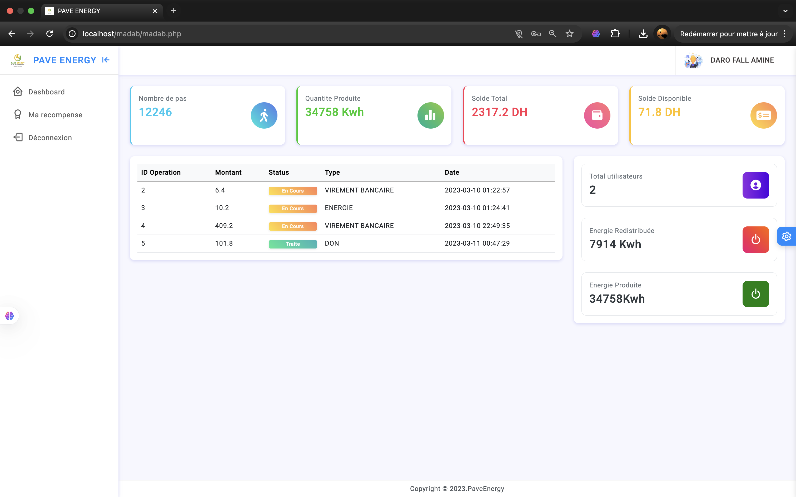

 <a href="./README.md">🇫🇷 Français</a> | <a href="./README.en.md">🇬🇧 English</a> 

---

  
  
  
  
  
  <h1>Madab - Intelligent Piezoelectric Pavers</h1>
  
🥈 Second Prize Winning Project at ESTD Hackathon on Sustainable Development Goals 
  Design of recycled pavers generating electricity through piezoelectricity + innovative reward system

## Table of Contents
1. [Introduction](#introduction)
2. [Key Features](#features)
3. [Reward System](#rewards)
4. [Technologies Used](#tech)
5. [Ecological Impact](#impact)
6. [Future Improvements](#future)
7. [Gallery](#gallery)
8. [Application Demo](#app)

---

## Introduction
**Madab** is an innovative solution born at the ESTD Hackathon on SDGs. Our multidisciplinary team (3 electrotechnicians + 2 computer scientists) developed pavers made from recycled materials that transform mechanical energy from footsteps into electricity using the piezoelectric effect.

These pavers are designed for high pedestrian traffic areas (airports, shopping malls, train stations). To encourage citizens to contribute to green energy production, we created a reward system via a web application that values each step as electricity.

**Addressed SDGs**:
- 🏙️ Sustainable Cities (SDG 11)
- ⚡ Clean Energy (SDG 7)
- ♻️ Responsible Consumption (SDG 12)
- 🏃 Health and Well-being (SDG 3)

  <a href="#top">⬆ Back to top</a>

---

## Key Features

### 🌱 Ecological Pavers
- Manufactured with recycled materials
- High energy yield
- Weather-resistant structure
- Rapid modular installation

### ⚡ Energy Production
- High-sensitivity piezoelectric sensors
- Energy storage system
- Integrated DC/AC conversion
- Real-time production monitoring

### 📱 Web Application
- Personal energy generation counter
- Geolocation of production zones

  <a href="#top">⬆ Back to top</a>

---

## Reward System
Our flagship innovation: transforming physical energy into social and economic value!

### 🎯 How It Works
1. User walks on equipped pavers
2. Sensors record generated energy
3. Application credits virtual account
4. Monthly point conversion to:

### 🏆 Reward Options
| Type | Benefits |
|------|-----------|
| 💶 **Monetary Credit** | Conversion to money |
| ⚡ **Free Electricity** | Bonus on electricity bill |
| ❤️ **Ecological Donation** | Contribution to public lighting |
| 🎁 **Local Partnerships** | Discounts at partner shops |

  <a href="#top">⬆ Back to top</a>

---

## Technologies Used

  
  
  
  

### Hardware
- Piezoelectric sensors
- Arduino Nano microcontrollers
- Signal conditioning circuits
- Batteries

### Software
- **Frontend**: Bootstrap 5, HTML, CSS
- **Backend**: PHP
- **Database**: MySQL
- **Algorithms**:
  - Energy/step calculation
  - Point/reward conversion
  - Production forecasting

  <a href="#top">⬆ Back to top</a>

---

## Ecological Impact

### Social Benefits:
1. Encourages walking
2. Citizen involvement in energy transition
3. Participatory funding of local projects

  <a href="#top">⬆ Back to top</a>

---

## Future Improvements

1. 🔄 **Energy Optimization**: New piezoelectric polymers
2. 📱 **Mobile Application**: Real-time tracking + community challenges
3. 🌍 **Hybrid Solar Module**: Combine piezoelectric and solar energy
4. 🔗 **Blockchain**: Tokenization of produced kWh (energy NFTs)
5. 🤖 **Predictive AI**: Anticipate pedestrian flows for storage optimization
6. ♿ **Universal Accessibility**: Adaptation for wheelchairs and bicycles

  <a href="#top">⬆ Back to top</a>

---

## Gallery

  <a href="#top">⬆ Back to top</a>

---

## Application Demo

  <a href="#top">⬆ Back to top</a>

