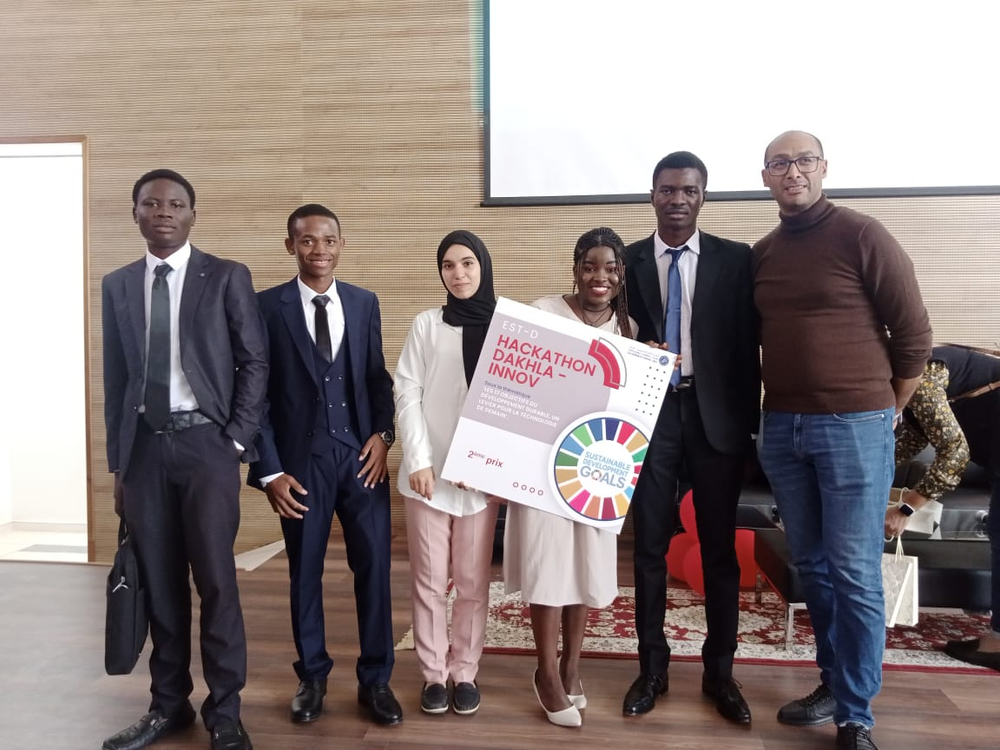
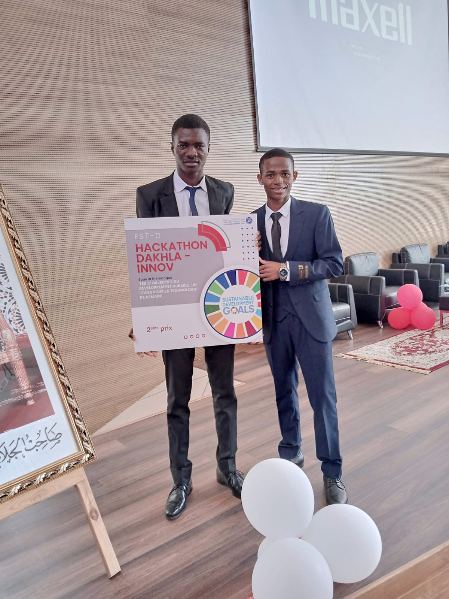
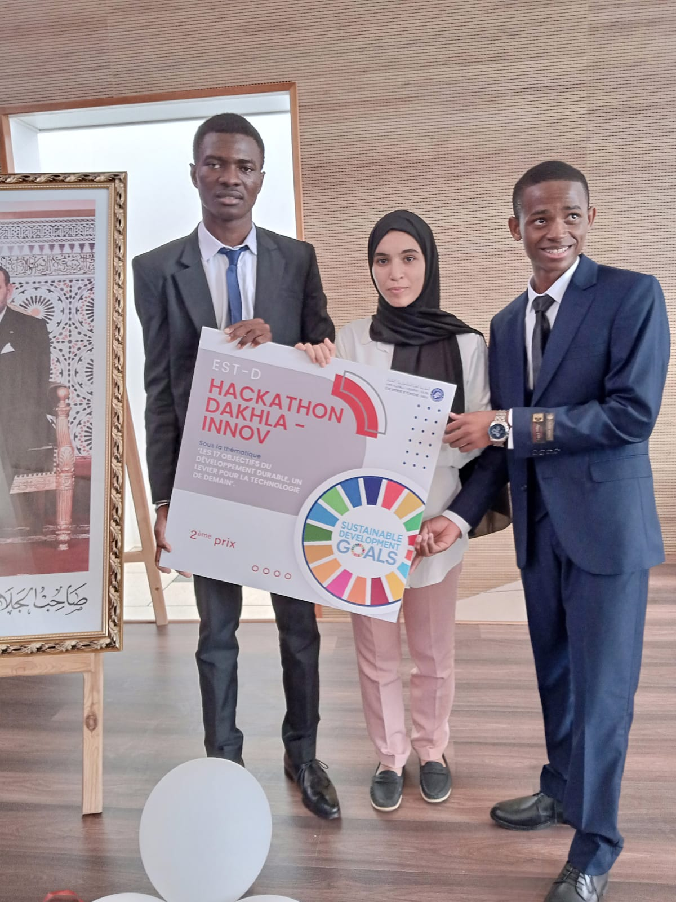
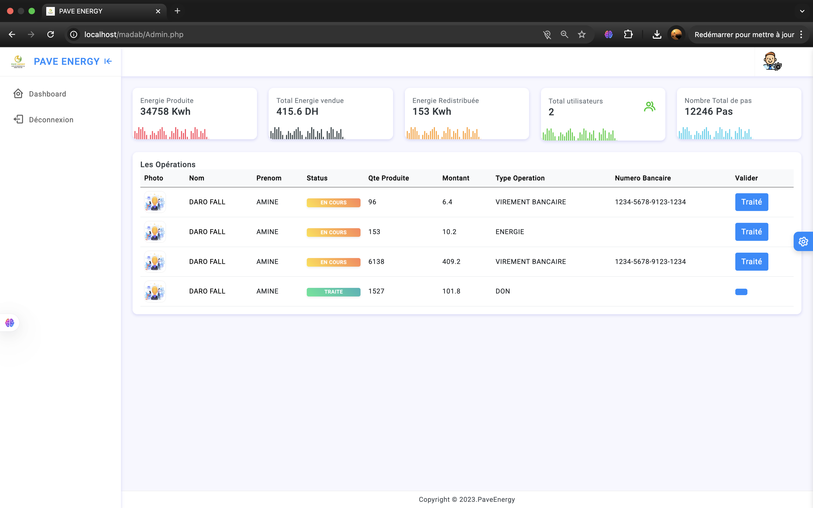
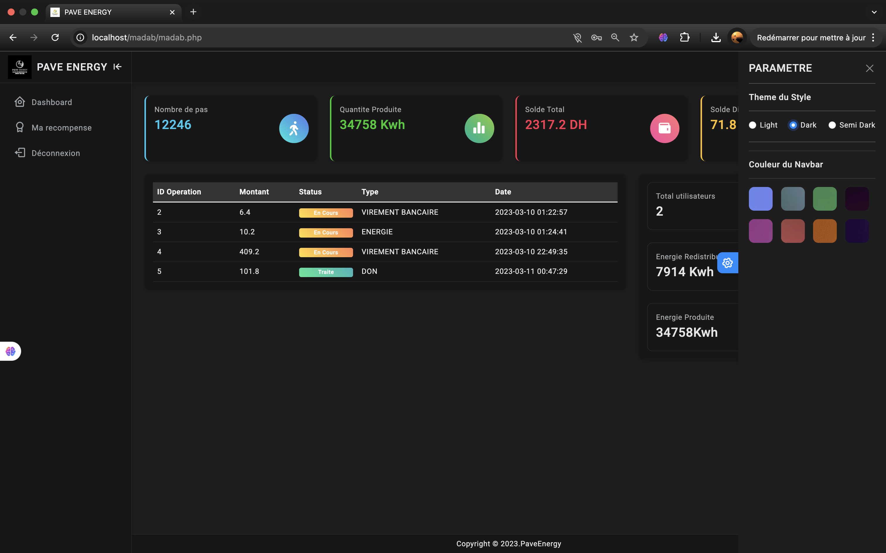
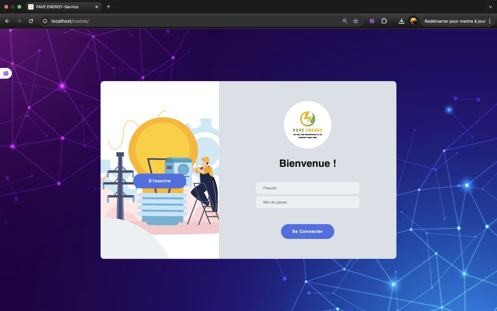
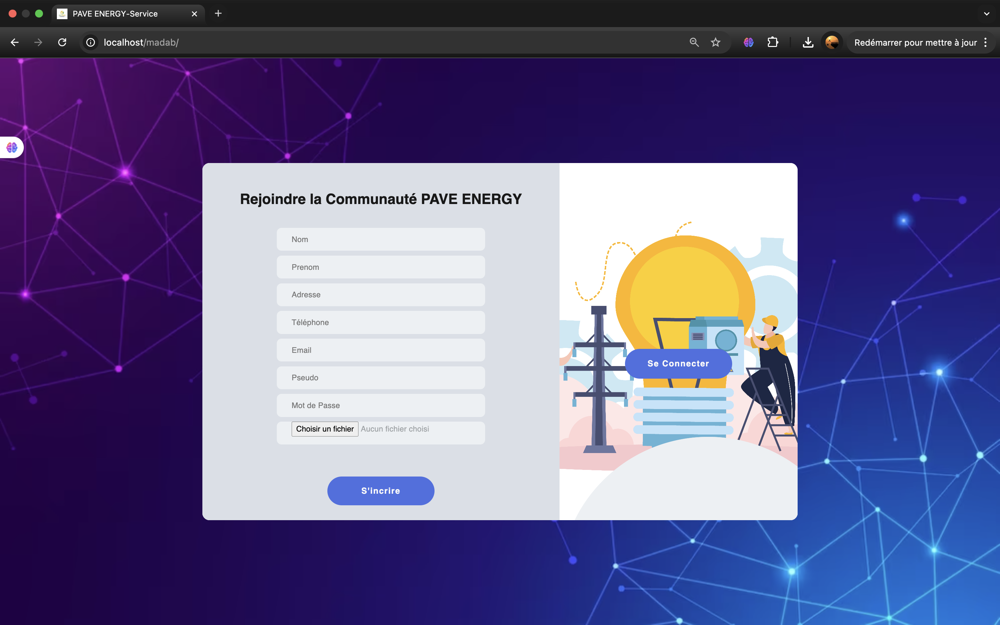
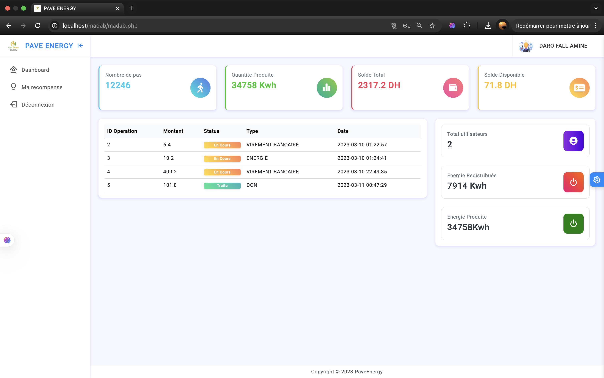

 <a href="./README.md">🇫🇷 Français</a> | <a href="./README.en.md">🇬🇧 English</a> 

---

  
  
  
  
  
  <h1>Madab - Pavés Piézoélectriques Intelligents</h1>
  
Projet lauréat 🥈 (2ème prix) du Hackathon ESTD sur les 17 Objectifs de Développement Durable 
  Conception de pavés recyclés générant de l'électricité par piézoélectricité + système de récompense innovant

## Table des Matières
1. [Introduction](#introduction)
2. [Fonctionnalités Clés](#features)
3. [Système de Récompense](#rewards)
4. [Technologies Utilisées](#tech)
5. [Impact Écologique](#impact)
6. [Améliorations Futures](#future)
7. [Galerie](#gallery)
8. [Démo de la partie application](#app)

---

## Introduction
**Madab** est une solution innovante née lors du Hackathon ESTD sur les ODD. Notre équipe pluridisciplinaire (3 électrotechniciens + 2 informaticiens) a développé des pavés fabriqués à partir de matériaux recyclés qui transforment l'énergie mécanique des pas en électricité grâce à l'effet piézoélectrique.

Ces pavés sont destinés aux zones à fort trafic piétonnier (aéroports, centres commerciaux, gares). Pour inciter les citoyens à contribuer à la production d'énergie verte, nous avons créé un système de récompense via une application web qui valorise chaque pas en électricité.

**Objectifs ODD adressés** : 
- 🏙️ Ville durable (ODD 11) 
- ⚡ Énergie propre (ODD 7) 
- ♻️ Consommation responsable (ODD 12)
- 🏃 Santé et bien-être (ODD 3)

  <a href="#top">⬆ Retour en haut</a>

---

## Fonctionnalités Clés

### 🌱 Pavés Écologiques
- Fabrication avec des matériaux recyclés
- Rendement énergétique 
- Structure résistante aux intempéries
- Installation modulaire rapide

### ⚡ Production d'Énergie
- Capteurs piézoélectriques haute sensibilité
- Système de stockage 
- Conversion DC/AC intégrée
- Monitoring en temps réel de la production

### 📱 Application Web
- Compteur personnel d'énergie générée
- Géolocalisation des zones de production

  <a href="#top">⬆ Retour en haut</a>

---

## Système de Récompense
Notre innovation phare : transformer l'énergie physique en valeur sociale et économique !

### 🎯 Comment ça marche
1. Un utilisateur marche sur les pavés équipés
2. Les capteurs enregistrent l'énergie produite
3. L'application crédite son compte virtuel
4. En fin de mois, conversion des points en :

### 🏆 Options de Récompense
| Type | Avantages | 
|------|-----------|
| 💶 **Crédit monétaire** | Conversion en argent  | 
| ⚡ **Électricité gratuite** | Bonus sur facture d'électricité | 
| ❤️ **Don écologique** | Contribution à l'éclairage public |
| 🎁 **Partenariats locaux** | Réductions chez commerçants partenaires | 

  <a href="#top">⬆ Retour en haut</a>

---

## Technologies Utilisées

  
  
  
  

### Matériel
- Capteurs piézoélectriques 
- Microcontrôleurs Arduino Nano
- Circuits de conditionnement de signal
- Batteries

### Logiciel
- **Frontend** : Bootstrap 5, HTML,  CSS
- **Backend** : PHP 
- **Base de données** : MySQL
- **Algorithmes** : 
  - Calcul énergie/pas
  - Conversion points/récompenses
  - Prévisions de production

  <a href="#top">⬆ Retour en haut</a>

---

## Impact Écologique

### Bénéfices sociaux :

1. Incitation à la marche 

2. Implication citoyenne dans la transition énergétique

3. Financement participatif de projets locaux

 <a href="#top">⬆ Retour en haut</a> 

---

## Améliorations Futures

1. 🔄 **Optimisation énergétique** : Nouveaux polymères piézoélectriques

2. 📱 **Application mobile** : Suivi en temps réel + challenges communautaires

3. 🌍 **Module solaire hybride** : Combiner piézoélectricité et énergie solaire

4. 🔗 **Blockchain** : Tokénisation des kWh produits (NFT énergétiques)

5. 🤖 **IA prédictive** : Anticiper les flux piétons pour optimiser le stockage

6. ♿ **Accessibilité universelle** : Adaptation pour fauteuils roulants et vélos

 <a href="#top">⬆ Retour en haut</a> 

---

## Galerie

 <a href="#top">⬆ Retour en haut</a> 

---

## Démo de la partie application

